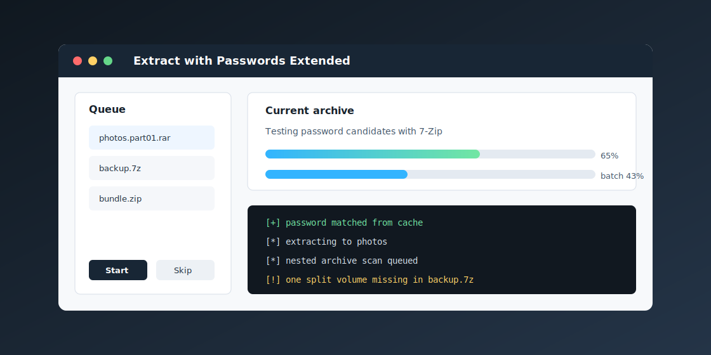

# Extract with Passwords Extended

[](https://github.com/erichuang1425/extract-with-passwords-extended/actions/workflows/ci.yml)
[](https://github.com/erichuang1425/extract-with-passwords-extended/releases/latest)
[](https://learn.microsoft.com/powershell/)
[](LICENSE)

Extract with Passwords Extended is a Windows archive extractor built for the awkward real-world case: a folder full of ZIP, RAR, 7z, split-volume, and nested archives where the right password might be somewhere in a list.

It adds Explorer right-click actions, a native WPF queue UI, console mode, password-list automation, multi-engine fallback, and careful logging so long extraction runs are easier to start, monitor, and recover from.



## Why It Exists

Archive tools are excellent once you already know the right password. They are less pleasant when you need to try a curated password list across a batch, keep track of split sets, avoid re-extracting giant files after each failed attempt, and understand why one archive failed while the rest succeeded.

This project wraps 7-Zip, WinRAR/UnRAR, and PeaZip's bundled 7z with a PowerShell workflow designed for repeatable extraction jobs on Windows.

## Highlights

- Explorer integration for archive files, folders, and folder backgrounds.
- WPF GUI with queue management, drag and drop, dual progress bars, live log output, skip/cancel controls, and row actions.
- Console mode for scriptable or keyboard-first workflows.
- Password-list cycling with optional no-password attempt, cache-first retries, and session-local reordering.
- Multi-engine fallback across 7-Zip, WinRAR/UnRAR, and PeaZip's bundled 7z.
- Header-based encryption checks so unencrypted ZIP/RAR/7z files skip password cycling.
- Test-only-then-extract mode to avoid repeated writes for every failed password.
- Split and multi-volume archive detection, including `.001`, `.part01.rar`, and related patterns.
- Optional recursive nested extraction with depth limits and payload-aware stopping.
- Clear failure classification for wrong password, corrupt archive, timeout, missing volume, permission errors, and engine failures.
- Configurable post-extraction actions, output folder naming rules, engine priority, logging, and parallelism.

## Tech Stack

- PowerShell 5.1+ compatible scripts and modules
- WPF/XAML for the Windows GUI
- 7-Zip, WinRAR/UnRAR, and PeaZip integration through command-line engine calls
- Pester unit tests for logic-heavy modules
- PSScriptAnalyzer linting
- GitHub Actions for CI and release packaging

## Requirements

- Windows 10 or Windows 11
- PowerShell 5.1 or newer recommended
- At least one supported extraction engine:
  - [7-Zip](https://www.7-zip.org/) recommended
  - [WinRAR](https://www.win-rar.com/)
  - [PeaZip](https://peazip.github.io/)

PowerShell 3.0 can run the console workflow, but PowerShell 5.1+ is recommended for the GUI, clipboard support, and toast notifications.

## Install

Download the latest release ZIP from [Releases](https://github.com/erichuang1425/extract-with-passwords-extended/releases/latest), extract it, then run:

```powershell
powershell -ExecutionPolicy Bypass -File .\Install-ArchivePwExtract.ps1
```

You can also double-click `Install.cmd` or right-click `Install-ArchivePwExtract.ps1` and choose **Run with PowerShell**.

The installer copies the tool to `%LOCALAPPDATA%\ArchivePwExtract\`, creates a default config, registers Explorer context-menu actions, creates a Send To shortcut, and opens the password-list template if one does not already exist.

## Usage

### Right-click an archive

Choose **Extract with password list** to open the GUI with the selected archive already queued. Choose **Extract in console (password list)** for the text-mode flow.

### Right-click a folder

Choose **Extract archives with password list** to scan the folder and queue supported archives. Folder background entries are also registered, so you can launch the workflow from inside a directory.

### Edit passwords

The default password file is:

```text
<Documents>\ArchivePwExtract\passwords.txt
```

Add one password per line. Lines beginning with `#` are ignored. When `loadAllPasswordFiles` is enabled, additional `.txt` files in the same folder are loaded too.

### Edit settings

Runtime settings live in:

```text
%LOCALAPPDATA%\ArchivePwExtract\config.json
```

Use the Explorer entry **Edit archive extractor config** or open the file directly.

## Common Configuration

| Setting | Default | Purpose |
| --- | --- | --- |
| `tryNoPasswordFirst` | `true` | Try unencrypted extraction before cycling passwords. |
| `testOnlyFirst` | `true` | Test passwords first, then extract once with the match. |
| `checkEncryptionBeforeCycling` | `true` | Inspect ZIP/RAR/7z headers before using the password list. |
| `usePasswordCache` | `true` | Store successful passwords and try them first later. |
| `maxParallelArchives` | `1` | Number of archives processed at once. |
| `maxParallelPasswords` | `1` | Number of passwords tested at once per archive. |
| `extractNestedArchives` | `false` | Recursively extract archives found inside outputs. |
| `maxNestedDepth` | `1` | Depth limit for nested extraction. |
| `existingOutputBehavior` | `replace` | Use `replace`, `merge`, or `new` for existing output folders. |
| `postExtractionAction` | `prompt` | Leave, delete, or sort source archives after extraction. |
| `engineProcessPriority` | `BelowNormal` | Lower engine process priority to keep Windows responsive. |
| `folderNameRules` | `[]` | Regex rules for cleaning generated output folder names. |

The full set of defaults is in [Modules/Config.ps1](Modules/Config.ps1).

## Supported Formats

Password cycling is used for encryption-capable formats:

| Format | 7-Zip | WinRAR | UnRAR |
| --- | --- | --- | --- |
| `.zip`, `.zipx` | Yes | Yes | No |
| `.7z` | Yes | Limited | No |
| `.rar` | Yes | Yes | Yes |

Direct extraction is used for formats that do not use the password workflow:

| Format family | Examples |
| --- | --- |
| Tar and compressed tar | `.tar`, `.tar.gz`, `.tgz`, `.tar.xz`, `.tar.zst` |
| Single-stream compression | `.gz`, `.bz2`, `.xz`, `.zst` |
| Disk/package images | `.iso`, `.wim`, `.img`, `.dmg`, `.cab` |

Compound tar archives are handled as two-step extractions, so files such as `.tar.zst` and `.tgz` are expanded to their final contents rather than leaving an intermediate `.tar` behind.

## Project Structure

```text
.
|-- Install-ArchivePwExtract.ps1   # Installer and uninstaller generator
|-- Install.cmd                    # Double-click installer launcher
|-- TryPwExtract.ps1               # Main orchestration script
|-- Modules/
|   |-- ArchiveUtils.ps1           # Archive detection and output paths
|   |-- Config.ps1                 # Defaults and config loading
|   |-- ConsoleUI.ps1              # Console prompts and summaries
|   |-- Extraction.ps1             # Engine detection and extraction calls
|   |-- Logging.ps1                # Logs, redaction, process execution
|   |-- NestedExtraction.ps1       # Recursive nested extraction pass
|   |-- Parallel.ps1               # Runspace-based concurrency
|   |-- Passwords.ps1              # Password loading and cache
|   |-- PowerManagement.ps1        # Keep-awake support
|   `-- WpfGui.ps1                 # GUI event flow
|-- Resources/MainWindow.xaml      # WPF layout
|-- Tests/                         # Pester suites
|-- docs/                          # Design notes and README assets
`-- .github/workflows/             # CI and release automation
```

## Development

Install the test tools once:

```powershell
Install-Module Pester -MinimumVersion 5.5.0 -Force -SkipPublisherCheck
Install-Module PSScriptAnalyzer -Force
```

Run tests and lint locally:

```powershell
.\Tests\PesterConfiguration.ps1
Invoke-ScriptAnalyzer -Path . -Recurse -Settings .\PSScriptAnalyzerSettings.psd1
```

The test suite focuses on deterministic PowerShell logic: config validation, password loading, cache behavior, archive detection, console formatting, nested extraction decisions, logging helpers, and power-management calls. Full GUI and engine integration still require manual Windows testing with installed archive engines.

## Release

Releases are versioned with semantic tags such as `v4.1.1`. Pushing a `v*` tag runs the release workflow, packages the scripts/modules/resources into a ZIP, and creates a draft GitHub release.

The application version is stored in two places that should stay in sync:

- `Modules/Config.ps1`
- `Install-ArchivePwExtract.ps1`

## Roadmap

- Add filename-derived password hints.
- Expand manual integration test notes for common 7-Zip and WinRAR installs.
- Add optional screenshot/GIF capture to the release process.
- Continue tightening GUI edge cases around long-running nested jobs.

## Security Notes

The password list and password cache are plaintext files on the local machine. This tool is intended for personal archive recovery/extraction workflows where that tradeoff is acceptable. Logs redact passwords, and console output masks matched passwords by default, but anyone with access to the password files can read them.

## License

[MIT](LICENSE)
